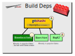

# Building gitohashi

## Dependency packages



 - libgit2
 
   https://libgit2.org/

 - libwebsockets (already in distros but requires master or v3.1 +)
 
   https://libwebsockets.org/git/libwebsockets
 
These are both easy-to-build cmake projects like gitohashi.

## Build

### Step 1: install build packages

Distro|Dependency Package name
---|---
Fedora | cmake, libgit2, libgit2-devel, libarchive, libarchive-devel
Ububtu 14.04 | cmake, libgit2-0, libgit2-dev, libarchive13, libarchive-dev
Ubuntu 16.04 | cmake, libgit2-24, libgit2-dev, libarchive13, libarchive-dev

#### Note on libgit2 versions

libjsongit2 support libgit2 going back to v0.19 found in Ubuntu 14.04 and up
to current master.

Blame support requires libgit2 version >=0.21, but libjsongit2 adapts to
versions older than that by gracefully disabling blame.

0.28+ (and master libgit2) support `.mailmap` integration with blame, again if
it's not available libjsongit2 blame still works without it.

If you want to build a later, local libgit2 to get these features, it is also a
cmake project that's easy to build the same way as libjsongit2 itself.

You can direct libjsongit2 to build using your local libgit2 instead of the
packaged version like this:

```
$ cmake .. -DJG2_GIT2_INC_PATH=/usr/local/include \
           -DJG2_GIT2_LIB_PATH=/usr/local/lib/libgit2.so
```

### Step 2: clone, build, install

One dependent project and gitohashi need to be built, but both of them can be
built will cmake using default options simply.

Order|Project|Clone command
---|---|---
1|libwebsockets| `git clone https://libwebsockets.org/repo/libwebsockets`
3|gitohashi| `git clone https://warmcat.com/repo/gitohashi`

enter the cloned dir for each in turn and build like this:

```
$ mkdir build
$ cd build
$ cmake ..
$ make && sudo make install
```

NOTE1: You can configure the daemon or other project to be built with symbols using
```
$ cmake .. -DCMAKE_BUILD_TYPE=DEBUG
```

NOTE2: If you are directly serving, HTTP/2 is advantageous performance-wise on
pages where there are a lot of avatars or other fetches going on from the same
server... you can enable this on libwebsockets simply with
`cmake .. -DLWS_WITH_HTTP2=1` instead of the `cmake ..` step.

NOTE3: On BSD / OSX the OpenSSL is in a strange place... you need to inform
the gitohashi build.  You can just do

```
$ export CFLAGS="-I/usr/local/opt/openssl/include" 
```

before the build.
